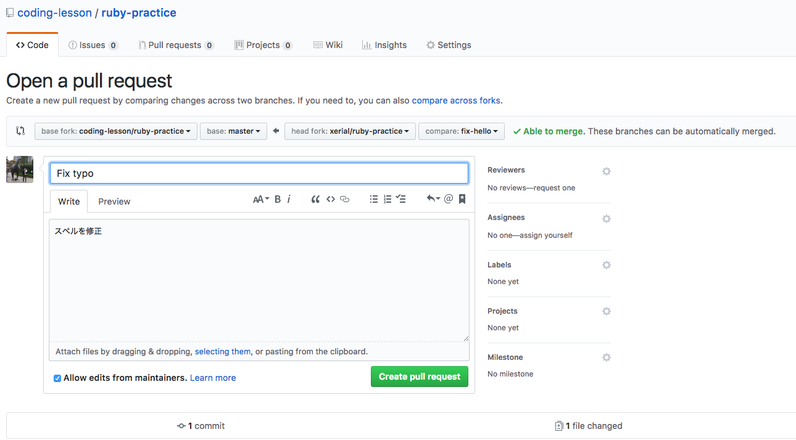

Git
====
Git(ギット)はソースコードを共有したり、コードの変更履歴を管理するためのツール。

## Gitの利点
- コードの変更を保存できる (git commit)
- コードの変更履歴を確認できる (git log)
- 試しにコードを書き換えられる (git branch)
- 他の人が作ったコードの最新版をダウンロードできる (git pull)
- 間違ってコードを変更しても以前の状態に戻れる (reset)
-- 試しに手元でコードを書き換えても安心
- コードに変更を加えた部分のみを共有できる (Pull Request)

## GitHubアカウントの作成

GitHubでは世界中のエンジニアがソースコードを共有（[オープンソース](open-source.html)化)し、日々コードが改良され続けている。

- [GitHub](https://github.com/)

## ソースコードの履歴を管理する

- [Git](https://git-scm.com/)
- [Git 15 minutes tutorial](https://try.github.io/levels/1/challenges/1)

## Git clone

準備
```
$ mkdir git
$ cd git
```

GitHub上にあるレポジトリ https://github.com/coding-lesson/ruby-practice の複製(clone)を自分のGitHubアカウントに作成する。


```shell
$ git clone https://github.com/(自分のGitHub アカウント名)/ruby-practice.git
Cloning into 'ruby-practice'...
Warning: Permanently added 'github.com,192.30.255.112' (RSA) to the list of known hosts.
remote: Counting objects: 6, done.
remote: Compressing objects: 100% (4/4), done.
remote: Total 6 (delta 0), reused 3 (delta 0), pack-reused 0
Receiving objects: 100% (6/6), done.

$ cd ruby-practice
$ ls 
README.md	hello-ruby.rb
```

## Pull Requestの作成

```shell
$ git checkout -b (branch名)
(コードに変更を加える)

$ git status

$ git add (変更したファイル名)

$ git commit -m "(変更の内容)"

$ git push -u origin (branch名)
```

### 作業例

```shell
$ git checkout -b fix-hello
Switched to a new branch 'fix-hello'

(hello-rubyを修正する)

$ git status
On branch fix-hello
Changes not staged for commit:
  (use "git add <file>..." to update what will be committed)
  (use "git checkout -- <file>..." to discard changes in working directory)

	modified:   hello-ruby.rb

no changes added to commit (use "git add" and/or "git commit -a")

$ git diff
diff --git a/hello-ruby.rb b/hello-ruby.rb
index d0a3ae6..74862d2 100644
--- a/hello-ruby.rb
+++ b/hello-ruby.rb
@@ -1 +1 @@
-puts "Hello Goby"
+puts "Hello Ruby"

$ git commit -am "Fix typo"
[fix-hello a044499] Fix typo
 1 file changed, 1 insertion(+), 1 deletion(-)

$ git push -u origin fix-hello
Warning: Permanently added 'github.com,192.30.255.113' (RSA) to the list of known hosts.
Counting objects: 12, done.
Delta compression using up to 8 threads.
Compressing objects: 100% (9/9), done.
Writing objects: 100% (12/12), 2.05 KiB | 1.02 MiB/s, done.
Total 12 (delta 2), reused 0 (delta 0)
remote: Resolving deltas: 100% (2/2), done.
To github.com:xerial/ruby-practice.git
 * [new branch]      fix-hello -> fix-hello
Branch fix-hello set up to track remote branch fix-hello from origin.
```

### Pull Requestの作成





コードの管理者がOKすると、コードの変更がmaster branchにマージされる。


## git remote

```
$ git remote add upstream git@github.com:coding-lesson/ruby-practice.git
$ git remote -v
origin	git@github.com:xerial/ruby-practice.git (fetch)
origin	git@github.com:xerial/ruby-practice.git (push)
upstream	git@github.com:coding-lesson/ruby-practice.git (fetch)
upstream	git@github.com:coding-lesson/ruby-practice.git (push)
```

masterブランチの最新版のコードをダウンロードする。
```
$ git checkout master
$ git pull upstream master
```

clone側のmasterに最新版のコードをpushする。
```
$ git push
```

https://github.com/(アカウント名)/ruby-practice
を開いて、確認する。

