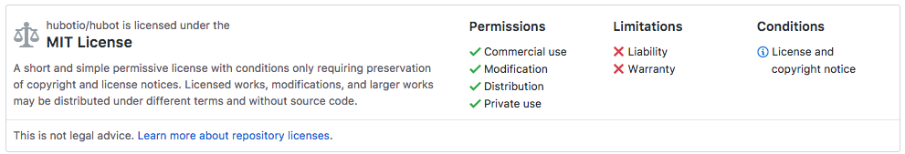
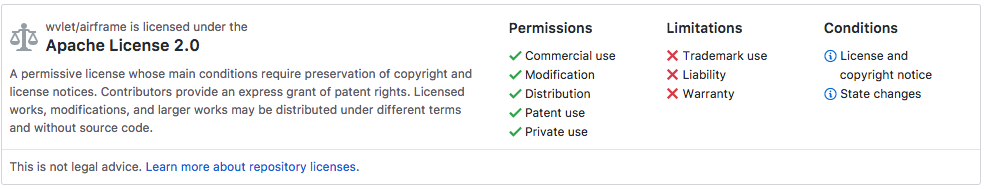
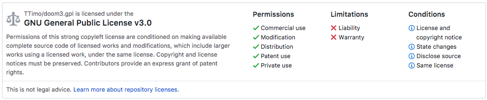

# オープンソース

ソースコードを公開する、自由に使える状態で配布すること。

基本はボランティア（個人、企業)で、ソースを公開することでの対価は通常得ていない。
そのため、オープンソース製品に関する質問、バグ報告などは礼儀正しく行うこと。

## ソフトウェアライセンス

自由に使って良いもの、駄目なものの見極めが必要。

### 制限がゆるいもの

- MIT License

- Apache License 2.0 (APL 2.0)

### 自由に使えるが、同じライセンスにしなくてはいけないもの
- GPL (GNU Public License)

　- 基本自由に使えるが、GPLの製品を使って作ったコードを配布するときは全てオープンソースにしなくてはならない。
  - 昔のMicrosoftなど、コードを非公開で占有していた(proprietary)企業への対抗手段として生まれた
    - Linuxのコードは全てGPLでオープンソース. 皆が「自由」に使える（フリーソフトウェア）
  - 例：Windows, Mac OS Xなどのコードは今でも非公開（ブランド戦略、セキュリティ）

## オープンソースの利点

- フリー(無料)で使えるので、多くの人が試しやすい => ユーザーが増える
  - 多くのフィードバックが得られる
  - バグが早く見つかる -> 修正 -> 良いプロダクトになる 
  - 開発者、ユーザーの双方の利益 （公共の財産)
  - コミュニティができる

- 他の人の書いたコードから学べる
  - 学習速度が早い => 世界の技術が高速で進化している

- GitHub, [RubyGems](https://rubygems.org/), などオープンソース用の無料のサービスを使える
  - 個人の開発者でも継続して作業できる
- GitHubでの活動がエンジニアとしての履歴書になる 

## オープンソースの欠点

- 活動が英語圏に集中
  - 英語を使えない人には恩恵が少ない  
- ビジネスが難しくなる
  - 無料で使えるものにお金を払う人は稀
  - 一部の機能はオープンソース、アドバンストな機能はクローズド(非公開)にしている企業がある
- コードの開発者の維持が難しい
  - 数年すると開発者がいなくなりやすい
  - そのため企業が支援するオープンソース製品に人気が集まりやすい
- ただし「人気がある」ことと「実際の問題に使える」ことには隔たりがある

