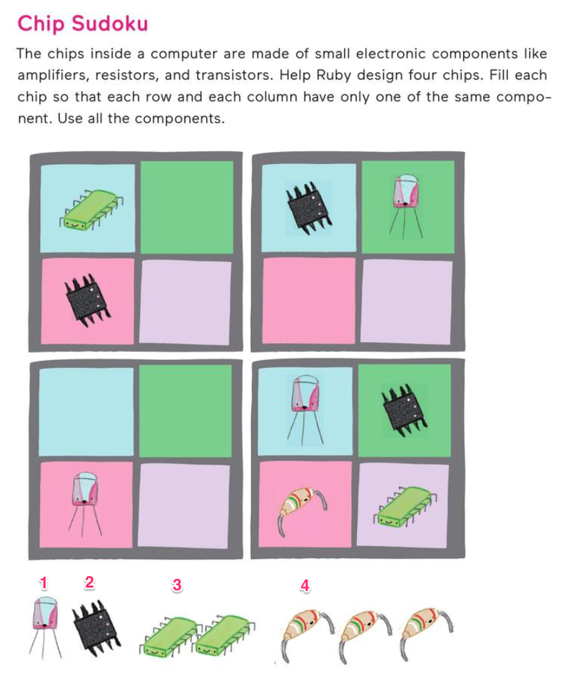
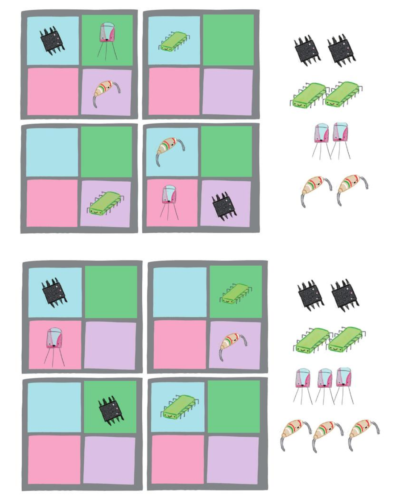
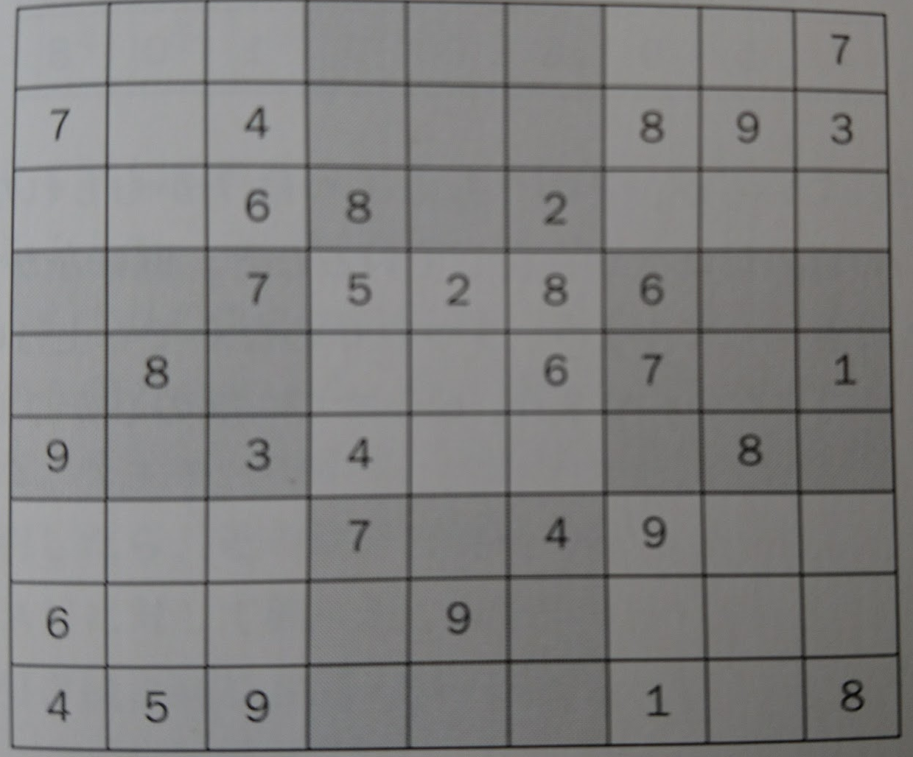

数独 (Sudoku)を解くプログラム
===



## ルール

- 横の列(row)には、1~Nまでの全ての数字が必ず１回ずつ入る
- 縦の列(col)にも、1~Nまでの全ての数字が必ず１回ずつ入る
- 各ブロック(BxBの大きさ)にも、1~Nまでの全ての数字が必ず１回ずつ入る

N=4のとき、B=2
N=9のとき、B=4

## 準備

- 参考コード https://github.com/coding-lesson/ruby-practice

N x N のボードを用意する。ArrayのArray(`board[row][col]`)を作る

- 0: 空マス
- 1 ~ N: 数字
- B: ブロックサイズ（BxB=Nになる)

### 4x4.txt
上の図と同じ問題データ。スペースは空のマスを表す。
```
3 21
2
  12
1 43
```

## 課題

以下の拡張をするためのpull requestを作成しよう。

例えば。。。
- 4x4の新しい問題を追加


- ファイル名を指定して、問題を読めるようにする
```
$ ruby sudoku.rb 4x4.txt
```
  - ヒント：この場合、`ARGV[0]`に`4x4.txt`の値が代入されている。
- ボードの表示を格好良くする 
  - (例えば0を表示しない)

- 9x9の問題を追加


- 9x9の大きなボードに拡張
　- `B`を変更できるようにする

- (発展) cellの候補が２つ以上あるときに、ボードを保存
  - ボードのコピーを作るには、`board.clone`とする
  - スタックのデータ構造を使う。配列に、現在のboardをpush（追加)、pop(取り出す)
